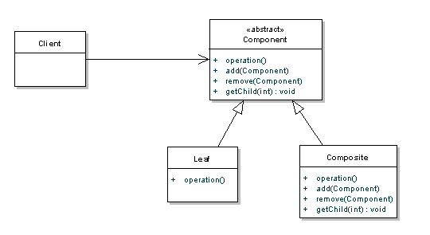
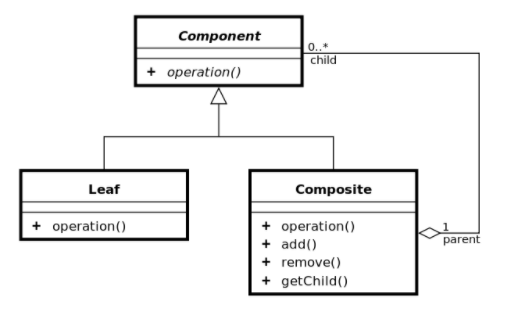

# Composite Pattern

### 목적
compositie pattern의 사용 목적은 object의 **hierarchies**를 표현하고 각각의 object를 독립적으로 동일한 인터페이스를 통해 처리할 수 있게한다.

아래 Composite pattern의 class diagram을 보자



위의 그림의 Leaf 클래스와 Composite 클래스를 같은 interface로 제어하기 위해서 Component abstract 클래스를 생성하였다.

위의 그림을 코드로 표현 하였다.

**Component 클래스**
```java
public class Component {
    public void operation() {
        throw new UnsupportedOperationException();
    }
    public void add(Component component) {
        throw new UnsupportedOperationException();
    }

    public void remove(Component component) {
        throw new UnsupportedOperationException();
    }

    public Component getChild(int i) {
        throw new UnsupportedOperationException();
    }
}
```
Leaf 클래스와 Compositie 클래스가 상속하는 Component 클래스로 Leaf 클래스에서 사용하지 않는 메소드 호출 시 exception을 발생시키게 구현하였다.

**Leaf 클래스**
```java
public class Leaf extends Component {
    String name;
    public Leaf(String name) {
        ...
    }

    public void operation() {
        .. something ...
    }
}
```

**Composite class**
```java
public class Composite extends Component {
    ArrayList components = new ArrayList();
    String name;

    public Composite(String name) {
        ....
    }

    public void operation() {
        Iterator iter = components.iterator();
        while (iter.hasNext()) {
            Component component = (Component)iter.next();
            component.operation();
        }
    }
    public void add(Component component) {
        components.add(component);
    }

    public void remove(Component component) {
        components.remove(component);
    }

    public Component getChild(int i) {
        return (Component)components.get(i);
    }
}
```

## 구현 시 고려해야할 사항
- 위의 코드는 parent만이 child를 참조할 수 있다. 구현 이전에 child가 parent를 참조해야 하는지 고려해야 한다.
- 어떤 클래스가 children을 관리할 것인가?

## Children 관리를 위한 2가지 Composite pattern


위의 예제로 Component 클래스에 add, removem getChild 같은 method가 선언이 되어있으며 Transparency를 제공한다.

장점 : Leaf 클래스와 Composite 클래스를 구분할 필요없이 Component Class로 생각할 수 있다.

단점 : Leaf 클래스가 chidren 관리 함수 호출 시 run time에 exception이 발생한다.



이전 예제에서 children을 관리하는 함수를 Composite 클래스에 선언 되어있으며 Safety를 제공한다.

장점 : Leaf 클래스가 chidren 관리 함수 호출 시 compile time에 문제를 확인할 수 있다.

단점 : Leaf 클래스와 Composite 클래스를 구분하여야 한다.

## 관련 패턴
### Decorator
공통점 : composition이 재귀적으로 발생한다.

차이점 : decorator 패턴은 responsibilites를 추가하는 것이 목표이지만 composite 패턴은 hierarchy를 표현하기 위해서 사용된다.

### Iterator
공통점 : aggregate object을 순차적으로 접근한다.